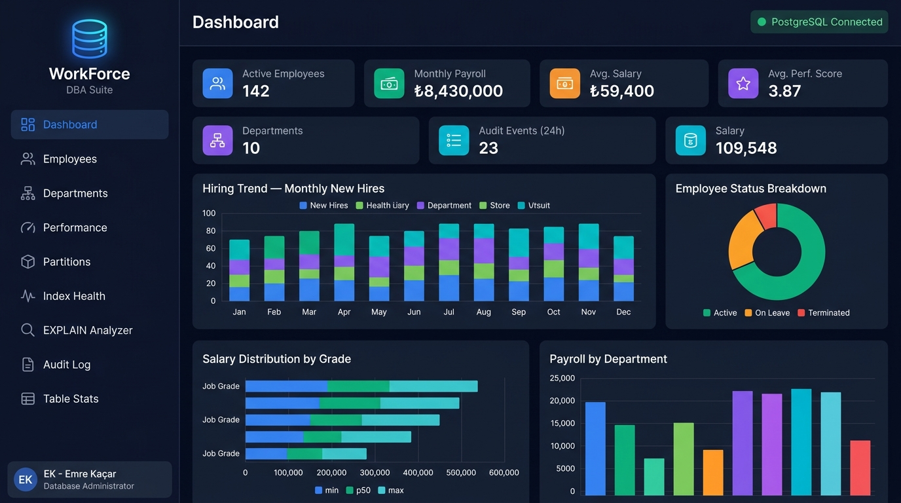

# 🗄️ EK HR DB Intelligence

<div align="center">

**Enterprise HR Database Performance Intelligence Platform**

*A comprehensive demonstration of advanced Database Administration techniques built on PostgreSQL — covering Partitioning, Covering Indexes, Materialized Views, PL/pgSQL, Triggers, EXPLAIN ANALYZE, and real-time performance monitoring.*

[](https://www.postgresql.org/)
[](https://fastapi.tiangolo.com/)
[](https://docs.docker.com/compose/)
[](LICENSE)

</div>

---



## 📌 What is This?

This project is a **production-grade database design** for an enterprise HR system, purpose-built to demonstrate the full skill set of a **Database Administrator (DBA)**. It includes:

- A **partitioned schema** with yearly Range Partitioning (Oracle-equivalent)
- An **advanced indexing strategy**: Covering, Partial, BRIN, GIN, Composite
- **5 Materialized Views** with `REFRESH CONCURRENTLY` strategy
- **6 PL/pgSQL stored functions/procedures** with cursors, window functions, exception handling
- **7 automated triggers**: audit trail, salary logging, business rule enforcement
- A **live web dashboard** with charts, EXPLAIN ANALYZE visualization, and DBA monitoring tools
- A **FastAPI backend** exposing 20+ REST endpoints powered directly by database views and functions

---

## 🎯 DBA Techniques Covered

| Technique | Implementation |
|---|---|
| **Range Partitioning** | `employees` partitioned by `hire_date` (2019–2025 + default) |
| **Covering Index** | `INCLUDE (first_name, last_name, salary)` — enables Index-Only Scan |
| **Partial Index** | `WHERE status = 'ACTIVE'` — eliminates inactive rows from index |
| **BRIN Index** | Time-series `hire_date` — minimal storage for sequential data |
| **GIN Index** | JSONB audit columns — supports forensic `@>` queries |
| **GIN Trigram** | Full-text name search using `pg_trgm` extension |
| **Materialized Views** | 5 MVs with `REFRESH CONCURRENTLY` — zero lock downtime |
| **Generated Columns** | `rating_label` and `cache_hit_ratio` computed at write time |
| **Window Functions** | `RANK()`, `PERCENT_RANK()`, `PERCENTILE_CONT()`, running totals |
| **Cursors** | `bulk_salary_adjustment` iterates with `FOR rec IN ... LOOP` |
| **Exception Handling** | Custom `ERRCODE`, re-raise pattern, friendly error messages |
| **AFTER Triggers** | Automatic salary history, JSONB audit capture, pg_notify |
| **BEFORE Triggers** | Business rule enforcement: termination policy, manager grade |
| **EXPLAIN ANALYZE** | Live query plan inspection via API endpoint |
| **Statistics Targets** | `SET STATISTICS 500` on high-cardinality columns |
| **pg_stat_statements** | Query performance snapshotting with trending |

---

## 🏗️ Architecture

```
┌─────────────────────────────────────────────────────────────┐
│                     WEB DASHBOARD                           │
│            (HTML + CSS + Chart.js — Dark Mode)              │
└────────────────────────┬────────────────────────────────────┘
                         │  HTTP REST
┌────────────────────────▼────────────────────────────────────┐
│                    FASTAPI BACKEND                           │
│            20+ endpoints · psycopg2 · Python 3.12           │
└────────────────────────┬────────────────────────────────────┘
                         │  SQL / PL/pgSQL
┌────────────────────────▼────────────────────────────────────┐
│                  POSTGRESQL 16                               │
│                                                             │
│  ┌─────────────┐  ┌──────────────────┐  ┌────────────────┐ │
│  │  Partitioned │  │  Materialized    │  │  Stored Procs  │ │
│  │  Tables      │  │  Views (5)       │  │  & Functions   │ │
│  │              │  │  REFRESH CONCUR. │  │  (6)           │ │
│  │  employees   │  │                  │  │                │ │
│  │  ├─2019      │  │  mv_dept_head    │  │  hire_employee │ │
│  │  ├─2020      │  │  mv_salary_dist  │  │  bulk_salary   │ │
│  │  ├─2021      │  │  mv_hiring_trend │  │  dept_analysis │ │
│  │  ├─2022      │  │  mv_slow_query   │  │  retention     │ │
│  │  ├─2023      │  │  mv_perf_leader  │  │  index_health  │ │
│  │  ├─2024      │  └──────────────────┘  │  perf_snapshot │ │
│  │  └─default   │                        └────────────────┘ │
│  └─────────────┘                                            │
│                                                             │
│  ┌──────────────────────────────────────────────────────┐   │
│  │  Triggers (7)                                        │   │
│  │  • trg_set_updated_at         (BEFORE UPDATE)        │   │
│  │  • trg_salary_change_log      (AFTER UPDATE salary)  │   │
│  │  • trg_generic_audit          (AFTER INSERT/UPD/DEL) │   │
│  │  • trg_validate_termination   (BEFORE UPDATE status) │   │
│  │  • trg_validate_manager       (BEFORE INSERT/UPDATE) │   │
│  │  • trg_budget_guard           (configurable)         │   │
│  │  • trg_notify_mv_refresh      (AFTER STATEMENT)      │   │
│  └──────────────────────────────────────────────────────┘   │
│                                                             │
│  ┌──────────────────────────────────────────────────────┐   │
│  │  Indexes                                             │   │
│  │  • Covering  idx_emp_dept_status_covering            │   │
│  │  • GIN       idx_emp_name_trgm (fuzzy search)        │   │
│  │  • BRIN      idx_emp_hire_date_brin (time-series)    │   │
│  │  • Partial   idx_review_outstanding (score >= 4.5)   │   │
│  │  • GIN       idx_audit_new_data_gin (JSONB forensic) │   │
│  │  • Composite idx_emp_salary_grade + INCLUDE          │   │
│  └──────────────────────────────────────────────────────┘   │
└─────────────────────────────────────────────────────────────┘
```

---

## 📁 Project Structure

```
ek-hr-db-intelligence/
├── docker-compose.yml          # One-command setup
├── database/
│   ├── migrations/
│   │   ├── 01_schema.sql       # Tables, partitions, constraints
│   │   ├── 02_indexes.sql      # All index strategies
│   │   ├── 03_materialized_views.sql
│   │   └── 04_seed_data.sql    # 200 employees, reviews, perf data
│   ├── procedures/
│   │   └── stored_procedures.sql
│   └── triggers/
│       └── triggers.sql
├── backend/
│   ├── main.py                 # FastAPI — 20+ endpoints
│   ├── requirements.txt
│   └── Dockerfile
├── frontend/
│   ├── index.html              # 9-tab dashboard
│   ├── style.css               # Dark mode design system
│   └── app.js                  # Chart.js + REST integration
└── scripts/
    └── init.sh                 # Docker DB init script
```

---

## 🚀 Quick Start

### Option 1: Docker (Recommended — one command)

```bash
git clone https://github.com/emrkacar2/ek-hr-db-intelligence.git
cd ek-hr-db-intelligence
docker-compose up --build
```

Open **http://localhost:8000** — done. ✅

### Option 2: Local Setup

**1. Start PostgreSQL and create the database:**
```bash
createdb ek_hr_db
```

**2. Run migrations in order:**
```bash
psql -d ek_hr_db -f database/migrations/01_schema.sql
psql -d ek_hr_db -f database/migrations/02_indexes.sql
psql -d ek_hr_db -f database/migrations/03_materialized_views.sql
psql -d ek_hr_db -f database/procedures/stored_procedures.sql
psql -d ek_hr_db -f database/triggers/triggers.sql
psql -d ek_hr_db -f database/migrations/04_seed_data.sql
```

**3. Start the backend:**
```bash
cd backend
pip install -r requirements.txt
python main.py
```

**4. Open the dashboard:**
```bash
open http://localhost:8000
```

---

## 🖥️ Dashboard Tabs

| Tab | What You See |
|---|---|
| **Dashboard** | KPI cards, Hiring trend, Status breakdown, Salary distribution, Payroll by dept |
| **Employees** | Searchable, filterable employee table with tenure, grade, salary |
| **Departments** | Budget utilization cards with visual progress bars |
| **Performance** | Top performers (RANK), Retention cohort chart |
| **Partitions** | Live partition sizes, row counts, range definitions |
| **Index Health** | `pg_stat_user_indexes` — scan counts, size, usage rating |
| **EXPLAIN Analyzer** | Run `EXPLAIN (ANALYZE, BUFFERS, FORMAT JSON)` and inspect plans |
| **Audit Log** | Every DML change with JSONB diff — captured by triggers |
| **Table Stats** | Cache hit ratios, table/index sizes, vacuum status |

---

## 🔍 Key SQL Highlights

### Range Partitioning (Oracle equivalent: `PARTITION BY RANGE`)
```sql
CREATE TABLE employees (
    employee_id  BIGSERIAL,
    hire_date    DATE NOT NULL,
    ...
    PRIMARY KEY (employee_id, hire_date)
) PARTITION BY RANGE (hire_date);

CREATE TABLE employees_2023
    PARTITION OF employees
    FOR VALUES FROM ('2023-01-01') TO ('2024-01-01');
```

### Covering Index — enables Index-Only Scan
```sql
CREATE INDEX idx_emp_dept_status_covering
    ON employees (department_id, status)
    INCLUDE (first_name, last_name, salary, job_grade)
    WHERE status = 'ACTIVE';
```

### Materialized View with REFRESH CONCURRENTLY (zero lock)
```sql
CREATE MATERIALIZED VIEW mv_dept_headcount AS
SELECT
    d.department_id,
    COUNT(e.employee_id) FILTER (WHERE e.status = 'ACTIVE') AS active_employees,
    SUM(e.salary)        FILTER (WHERE e.status = 'ACTIVE') AS total_payroll,
    ...
FROM departments d LEFT JOIN employees e ...
WITH DATA;

CREATE UNIQUE INDEX idx_mv_dept_headcount_pk ON mv_dept_headcount(department_id);
-- Unique index required for CONCURRENTLY
REFRESH MATERIALIZED VIEW CONCURRENTLY mv_dept_headcount;
```

### Window Functions in PL/pgSQL
```sql
SELECT
    RANK()         OVER (PARTITION BY department_id ORDER BY salary DESC),
    PERCENT_RANK() OVER (ORDER BY salary),
    PERCENTILE_CONT(0.90) WITHIN GROUP (ORDER BY salary),
    SUM(salary)    OVER (PARTITION BY department_id ORDER BY salary DESC
                         ROWS BETWEEN UNBOUNDED PRECEDING AND CURRENT ROW)
FROM employees WHERE status = 'ACTIVE';
```

### JSONB Audit Trigger
```sql
CREATE OR REPLACE FUNCTION trg_generic_audit() RETURNS TRIGGER AS $$
BEGIN
    INSERT INTO audit_log (table_name, operation, old_data, new_data, ...)
    VALUES (TG_TABLE_NAME, TG_OP, to_jsonb(OLD), to_jsonb(NEW), ...);
    RETURN NULL;
END; $$ LANGUAGE plpgsql;
```

---

## 📊 API Endpoints

| Endpoint | Description |
|---|---|
| `GET /api/overview` | KPI summary |
| `GET /api/departments` | MV: headcount + payroll |
| `GET /api/salary/distribution` | MV: salary bands with percentiles |
| `GET /api/hiring/trend` | MV: monthly hires |
| `GET /api/performance/leaderboard` | MV: RANK() leaderboard |
| `GET /api/performance/retention` | Cohort retention analysis |
| `GET /api/dba/partition-info` | Live partition metadata |
| `GET /api/dba/index-health` | `pg_stat_user_indexes` report |
| `GET /api/dba/explain/{key}` | `EXPLAIN ANALYZE` result |
| `GET /api/dba/audit-log` | Recent audit events |
| `GET /api/dba/table-stats` | Table + index sizes |
| `GET /api/dba/cache-hit` | Buffer cache hit ratio |
| `GET /api/employees` | Search/filter employees |

Full API docs: **http://localhost:8000/docs**

---

## 👤 Author

**Emre Kaçar**
Database Administrator | Oracle & PL/SQL Specialist | Data Warehouse

- 🔗 [LinkedIn](https://linkedin.com/in/emre-kacarr)
- 💻 [GitHub](https://github.com/emrkacar2)

---

## 📄 License

MIT License — feel free to fork and build on this.
